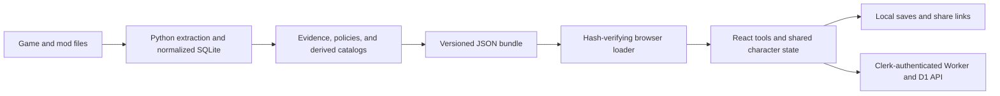

# Silt Strider Tools

A data-driven companion for **Morrowind and Tamriel Rebuilt**: plan characters,
compare equipment, calculate potions and spells, and explore progression using
structured game data.

[Live application](https://siltstrider.tools/) ·
[Engineering case study](docs/CASE_STUDY.md) ·
[Five-minute demo](docs/DEMO.md) ·
[Data pipeline](https://github.com/lowgraph/openmw-decompiler)

## Project and contribution

This is a human-directed, AI-assisted portfolio project. My work centers on product
requirements, decomposition, data and application boundaries, game research,
recommendation policies, acceptance criteria, hands-on validation, and release
decisions. Specialized coding agents contributed implementation: Codex on the
application, Claude on the pipeline, and Antigravity on UI architecture.

The code is not presented as entirely hand-written. The case study explains the
choices, defects, and validation behind it, with links to inspectable implementation.

## What you can explore

- **Character planning:** premade and custom builds, skill and attribute calculations,
  early-game recommendations, and late-game best-in-slot comparisons.
- **Shared tools:** alchemy, enchanting, spellmaking, travel, a level simulator, and
  faction progression requirements.
- **Existing characters:** parse an OpenMW `.omwsave` in the browser and use its
  observations in character, equipment, progression, and journal views.
- **Repeatable challenges:** seeded runs, saved preferences, and shareable links.
- **Three profiles:** Vanilla, Tamriel Rebuilt, and TR + ARCE. The TR profile includes
  Tamriel_Data, Cyr_Main, and Sky_Main.

Try the public site first; a game installation is not needed to browse its tools.
A save file is optional. Cloud account features depend on deployed service configuration.

## Architecture



The [pipeline repository](https://github.com/lowgraph/openmw-decompiler) owns extraction
and analytical datasets. This repository owns the web application. The browser reads
published catalogs, never extraction databases.

| Layer | Implementation |
| --- | --- |
| Application | Next.js 16 App Router, React 19, Tailwind CSS 4 |
| Data consumption | On-demand catalogs, SHA-256 validation, pinned release, profile inheritance/deltas |
| State | Shared character context, validated local saves, permalink codecs |
| Backend | Cloudflare Worker routes, D1 schema, Clerk token verification |
| Verification | Node test runner, jsdom, synthetic fixtures, contract tests |

The current entry point is a **native React AppShell**. The original HTML and
archived adapters remain regression references; production no longer depends on
extracting that HTML before development or builds.

## Engineering evidence

| Decision or problem | Inspect the implementation |
| --- | --- |
| Prevent mixed or tampered data releases | [Bundle loader](lib/bundle-loader.mjs), [contract tests](test/bundle-contract.test.js) |
| Keep derived recommendations traceable to policy and data | [Data contract](DATA_LOADER.md), [pipeline](https://github.com/lowgraph/openmw-decompiler) |
| Preserve character inputs across storage and links | [State design](STATE.md), [permalink codec](lib/permalink-codec.mjs) |
| Turn binary saves into usable observations | [Save parser](lib/omwsave-parser.mjs), [import adapter](lib/omwsave-import.mjs) |
| Catch a real catalog-to-calculator integration defect | [Alchemy regression tests](test/alchemy-live.test.js), [case study](docs/CASE_STUDY.md#case-study-alchemy-integration) |
| Separate login from record ownership | [Worker authentication](cloudflare/auth.mjs), [save routes](cloudflare/routes/saves.mjs) |

## Run locally

Use Node.js **22.11 or newer** and npm.

```powershell
npm ci
npm run dev
```

Open <http://localhost:8765/>. Generated game bundles are deliberately excluded from
Git. A fresh clone can run code and synthetic tests, but catalog-backed tools need
a staged bundle to function. It is not a complete offline demo out of the box.

If you have an already-built bundle from the data pipeline:

```powershell
npm run data:stage -- A:\Cache\OpenMWFoundation\app-bundle
```

Staging validates the release before changing `public/game-data/current.json`.
See [DATA_LOADER.md](DATA_LOADER.md) for the contract and configuration. A full
extraction requires separately installed game/mod files; it is not a frontend setup step.

For optional local authentication, set `CLERK_PUBLISHABLE_KEY` in an ignored
`.env.local`. Never put a secret key in public assets. Worker secrets and D1 bindings
are separate backend configuration; see [backend notes](cloudflare/README.md).

## Verify

```powershell
npm test
npm run build
```

For this project's Windows workflow, set `TEMP` and `TMP` to an existing `A:\Cache`
before running tests. Builds use `next/font/google` and may need network access
when font assets are not cached.

Most checks use synthetic fixtures. Some optionally read a locally staged bundle,
so a fresh-clone result is not equivalent to validating a complete game-data release.
The local checkpoint on **23 September 2026** passed **392 tests** and a production
build after the alchemy corrections. This is a dated local result, not a CI badge
or a claim about the currently deployed revision.

## Deployment

`main` is the release branch. GitHub pushes do not automatically deploy the site.
See the [release procedure](docs/DEPLOYMENT.md) for the manual Cloudflare workflow.

## Status and limits

- Native tools, save import, cloud-save routes, and codecs are implemented. Their
  presence in source does not prove a particular production environment is configured.
- Gear recommendations depend on published candidates and authored policy. They do
  not simulate every possible script or guarantee every acquisition route.
- Alchemy now consumes engine rules and profile settings; the latest corrections
  have automated coverage. Browser visual verification and release are still pending.
- No adoption, performance, or production-reliability metrics are claimed here.
- The [demo guide](docs/DEMO.md) includes the checks required before presenting a release.

## Further reading

- [Case study and tradeoffs](docs/CASE_STUDY.md)
- [Demo walkthrough and presentation checklist](docs/DEMO.md)
- [Data loader contract](DATA_LOADER.md)
- [Character state and persistence](STATE.md)
- [Migration history](MIGRATION.md)
- [Team coordination](COORDINATION.md)

Silt Strider is an unofficial fan project, unaffiliated with Bethesda or the mod teams.
Game and mod ownership remains with their respective creators. See the site's About
page and bundled font notices for credits.
